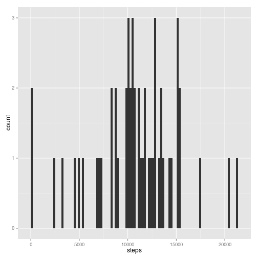
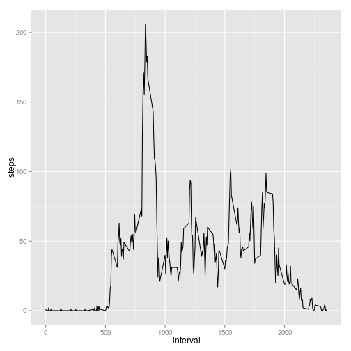
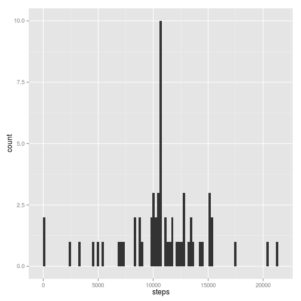
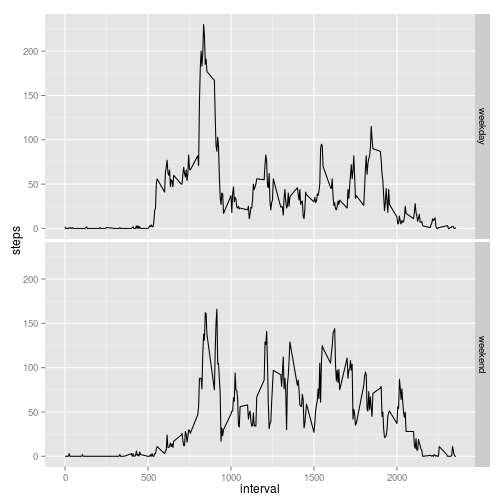

## Loading and preprocessing the data
We will start by loading the data into a data frame named *data*

```r
  library(utils)
  data<-read.table(unz("activity.zip","activity.csv"),sep=",",header = TRUE)
```

## What is mean total number of steps taken per day?
To obtain the sum of steps by day we will use the [aggregate](https://stat.ethz.ch/R-manual/R-devel/library/stats/html/aggregate.html) function 

```r
  library(stats)
  data_by_day <-aggregate(steps ~ date, data, sum)
```

Now we'll show a histogram of the total daily steps using the ggplot2 library.  I was getting warnings about binwidth so I am using the advice of [this](http://stackoverflow.com/questions/7458796/how-to-suppress-qplots-binwidth-warning-inside-a-function) answer to go around them.

```r
  library(ggplot2)
  ggplot(data = data_by_day, aes(x = steps)) + geom_histogram(binwidth = diff(range(data_by_day$steps))/100)
```

 

We will now calculate the mean and median of the steps/day:

```r
  mean<-mean(data_by_day$steps)
  median<-median(data_by_day$steps)
```
And print them

```r
  print(mean)
```

```
## [1] 10766.19
```

```r
  print(median)
```

```
## [1] 10765
```

## What is the average daily activity pattern?
Create the dataframe corresponding to average steps by interval and create the plot

```r
  library(sqldf)
```

```
## Loading required package: gsubfn
## Loading required package: proto
## Loading required package: RSQLite
## Loading required package: DBI
```

```r
  data_by_interval<-sqldf('SELECT interval, avg(steps) as steps FROM data GROUP BY interval')
```

```
## Loading required package: tcltk
```

```r
  ggplot(data=data_by_interval, aes(x=interval, y=steps)) + geom_line()
```

 
Print the interval where the maximum average number of steps occurs in a day:

```r
  print(data_by_interval[which(data_by_interval[,2]==max(data_by_interval[,2],na.rm=TRUE)),1])
```

```
## [1] 835
```


## Imputing missing values

Show the number of NAs in the data frame

```r
  print(sum(!complete.cases(data)))
```

```
## [1] 2304
```

We will create a new dataset where the NA values are replaced with the average of the interval for all days, recreate the dataset of the sum of steps by day and recreate the histogram with the new data

```r
  data2<-data
  data2nas<-which(is.na(data2$steps))
  data2$steps[data2nas]<-data_by_interval$steps[match(data2$interval[data2nas], data_by_interval$interval)]
  data_by_day2 <-aggregate(steps ~ date, data2, sum)
  library(ggplot2)
  ggplot(data = data_by_day2, aes(x = steps)) + geom_histogram(binwidth = diff(range(data_by_day2$steps))/100)
```

 

We will now calculate the mean and median of the adjusted steps/day:

```r
  mean<-mean(data_by_day2$steps)
  median<-median(data_by_day2$steps)
```
And print them

```r
  print(mean)
```

```
## [1] 10749.77
```

```r
  print(median)
```

```
## [1] 10641
```

The effect of adjusting the missing values with the averages is that we now have a slightly lower mean and median while we have an increase in the number of days where the number of steps was close to the median as expected by the substitution strategy we defined.

## Are there differences in activity patterns between weekdays and weekends?
add the dayType factor to data2, create the new data by interval frame that contains and groups by the day type and create the two charts

```r
 data2$dayType<-ifelse(weekdays(as.Date(data2$date)) %in% c("Saturday", "Sunday"), "weekend","weekday")
 data_by_interval2<-sqldf('SELECT interval, avg(steps) as steps, dayType FROM data2 GROUP BY dayType, interval')
 ggplot(data=data_by_interval2,aes(x = interval, y=steps)) + geom_line() + facet_grid(dayType ~ .)
```

 
